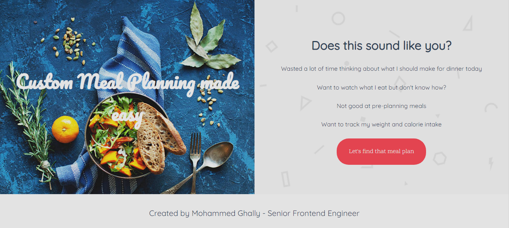

<div align="center">

<<<<<<< HEAD
  

  <h2>Serenity - Prototype</h2>
=======
  <h2>Green Serenity - Prototype</h2>
>>>>>>> 69834d2eec61c3e2d09151f924ef89138c026ee7

  <h3>
    <a href="https://serenity-demo.netlify.app">
      <strong>Demo Website</strong>
    </a>
  </h3>

  <div align="center">
    <a href="https://serenity-demo.netlify.app">View Demo</a>

  </div>

  <hr>

</div>

<!-- Brief -->
<p align="center">
--Serenity is a small, healthy dining spot catering to nutrition and fitness enthusiasts who exclusively choose healthy foods where users can order one or more healthy meals recommendations based on their BMR calculator and personal preferences which enables them to save time and money.
</p>

<!-- Screenshot -->
<a align="center" href="https://serenity-demo.netlify.app">



</a>

## Table of contents

- [Built with](#built-with)
- [Installation](#installation)
- [Author](#author)

### Built with

- React
- SASS
- Flexbox
- Edamam recipe search API

### Installation

- Clone this repo:

```sh
git clone https://github.com/mghally999/serenity-proto.git
```

- Install dependencies:

```sh
npm install
Don't forget to make an API ID and Key provided by Edamam API [Recipe Search API](https://developer.edamam.com/edamam-docs-recipe-api)
```

- Build command:

```sh
npm run build
```

- Live server:

```sh
npm run start
```

### Author

<b>👤 Mohammed Ghally</b>

- LinkedIn - [@mghally999](https://www.linkedin.com/in/mghally999/)
- Github: [@mghally999](https://github.com/mghally999)

Feel free to contact me with any questions or feedback!
